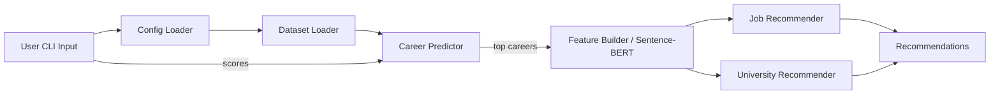
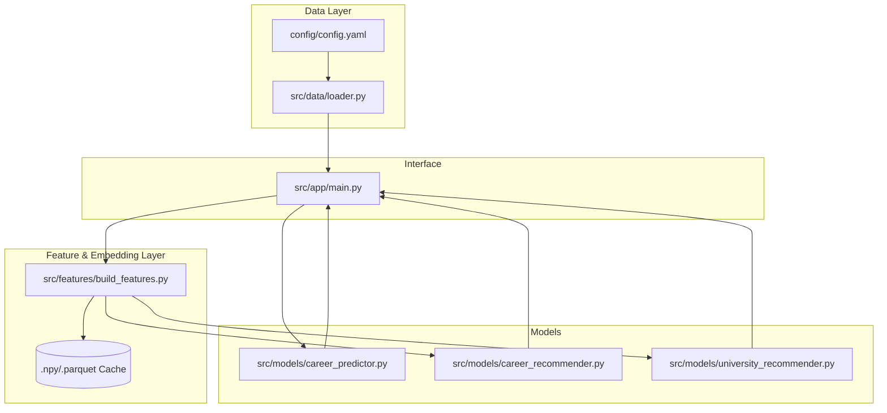

This file contains the architecture overview of the Career Path Recommender System backend.

# Architecture Overview
The Career Path Recommender System guides students toward suitable careers, universities, and jobs by combining classic ML models with modern NLP-based similarity search. User inputs (exam scores, soft skills, free-text interests, location) feed a multi-stage pipeline that normalizes data, encodes semantic meaning, and returns ranked recommendations across domains.

## High-Level Flow
1. **Configuration & Data Loading** – `run_pipeline()` reads YAML settings and loads CSV datasets via [backend/src/data/loader.py](backend/src/data/loader.py).
2. **Model Initialization** – Models are instantiated once per run: Random Forest career predictor, Sentence-BERT feature builders, university cache, and job recommender (see [backend/src/app/main.py](backend/src/app/main.py)).
3. **User Intake** – The CLI collects validated numeric scores plus free-form interests and preferred location, ensuring clean inputs for downstream models.
4. **Career Prediction** – Structured features feed the Random Forest classifier to generate the top-k career fields.
5. **Semantic Retrieval** – The highest-confidence career string (or user query) is encoded into vectors; cosine similarity retrieves matching jobs and universities.
6. **Presentation Layer** – Ranked universities and job titles are printed with confidence metrics; the loop continues until the user exits.

## Component Breakdown
### Data Layer
- **Config & datasets**: Files under `backend/config/` define CSV locations for student scores, jobs, and universities.
- **Loader**: [backend/src/data/loader.py](backend/src/data/loader.py) abstracts YAML parsing and dataset ingestion, trimming column whitespace and providing pandas DataFrames to the pipeline.

### Feature Engineering & NLP
- **Sentence-BERT**: [backend/src/features/build_features.py](backend/src/features/build_features.py) wraps SentenceTransformer loading with a singleton cache to prevent repeated model downloads.
- **Prepared embeddings**: Job and university corpora are concatenated into `content`/`search_text`, encoded in batches, and cached as `.parquet`/`.npy` artifacts for cold-start avoidance.

### ML / Recommenders
- **CareerPredictor**: [backend/src/models/career_predictor.py](backend/src/models/career_predictor.py) trains or loads a RandomForestClassifier with label encoding and defensive input validation. Model weights live in `models/career_predictor.pkl`.
- **CareerRecommender**: [backend/src/models/career_recommender.py](backend/src/models/career_recommender.py) performs cosine-similarity lookup over job embeddings, ensuring unique `job_idx` tracking for stable references.
- **UniversityRecommender**: [backend/src/models/university_recommender.py](backend/src/models/university_recommender.py) unifies Indian and global datasets, builds/caches embeddings, and filters via country/state heuristics (with alias support for inputs like “USA”).

### Application Layer
- **CLI Orchestrator**: [backend/src/app/main.py](backend/src/app/main.py) supplies the user interface, enforces integer score collection, orchestrates model execution, and formats the final recommendations.
- **Utilities & Future APIs**: `backend/src/db/mongo.py` offers ready-to-use MongoDB helpers for persistence once the CLI evolves into a FastAPI service.

## Persistence & Caching
- **Model storage**: Serialized ML artifacts reside under `backend/models/`, managed via `ModelStorage` abstractions for save/load symmetry.
- **Embedding cache**: Heavyweight Sentence-BERT encodings are stored as `models/cache/job_embeddings.npy`, `job_df.parquet`, and `university_embeddings.npy`, so later runs skip recomputation.
- **Environment dependencies**: `requirements.txt` lists core libs (pandas, scikit-learn, sentence-transformers, nltk) ensuring reproducible environments.

## Reliability & Defensibility Highlights
- Input guards convert CLI responses to integers and re-prompt on invalid data, preventing predictor crashes.
- Dataset builders raise explicit errors on missing columns, making ingestion failures actionable.
- Structured logging (`logging` module) documents model loading, training, and evaluation steps for observability.
- Country alias mapping prevents user typos (“US”, “USA”, “United States”) from eliminating valid university hits.
- Modular design—data loaders, feature builders, predictors, recommenders—keeps Single Responsibility Principle intact, easing future API conversion.

## Future Extensions
- Swap the CLI front-end for FastAPI to expose REST endpoints (reuse the existing pipeline functions).
- Wire Mongo persistence to store user sessions, recommendation feedback, and audit trails.
- Add NLP utilities (skill extraction, keyword expansion) under [backend/src/features/nlp_utils.py](backend/src/features/nlp_utils.py) to enrich queries prior to embedding.
